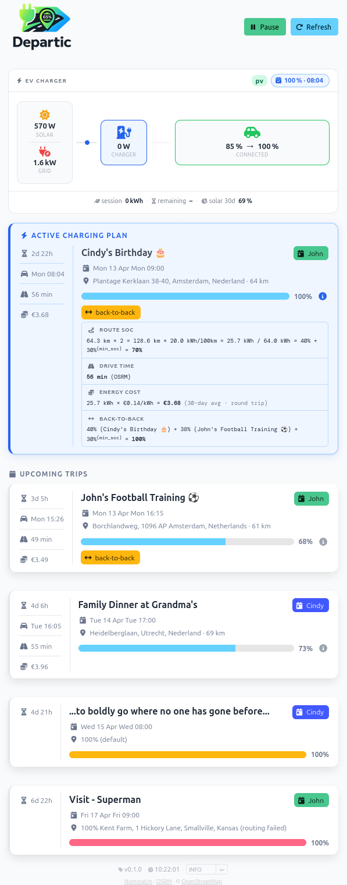

<p align="center">
  
</p>

<h3 align="center">Departure-driven EV charge planning via iCal &amp; EVCC</h3>

<p align="center">
  <a href="https://github.com/nickybulthuis/departic/actions/workflows/ci.yml"></a>
  <a href="https://github.com/nickybulthuis/departic/actions/workflows/release.yml"></a>
  <a href="LICENSE"></a>
  <a href="https://github.com/nickybulthuis/departic/releases"></a>
</p>

---

**Departic** reads `#trip` events from your calendar, calculates the required
State of Charge (SoC) for a round trip using OpenStreetMap routing, and sets a
charging plan in [EVCC](https://evcc.io) so your car is ready at departure
time.

> [!NOTE]
> **About this project** — Departic started as a side project to explore how AI
> changes the way software is written. A large part of the codebase was iterated
> on with AI, making it easy to prototype quickly and refine in small steps.
> Over time it became something practical — it now runs daily and plans our
> EV charging based on usage patterns, pricing, and timing constraints.
>
> It's opinionated and built around our driving routines and habits, but
> should work for similar setups — your mileage may vary. If you're adapting
> this to your own situation, I'd love to hear how you approached it.
>
> *Provided as-is, without warranty. Treat the output as a suggestion
> — always validate your charging plan before relying on it.*

## How it works

```
┌──────────────┐     ┌──────────┐     ┌──────────────┐     ┌──────┐
│  iCal feeds  │────▶│ Departic │────▶│  EVCC API    │────▶│  EV  │
│  (#trip tag) │     │          │     │  (plan/soc)  │     │  ⚡  │
└──────────────┘     └────┬─────┘     └──────────────┘     └──────┘
                          │
                   ┌──────┴──────┐
                   │ Nominatim   │  geocoding
                   │ OSRM        │  routing
                   └─────────────┘
```

1. A calendar event with a location and `#trip` tag triggers Departic to
   geocode both addresses, calculate driving distance, and convert it to a SoC
   target.
2. **SoC target** = round-trip energy / battery capacity + EVCC `minSoC`.
3. A charging plan is created via
   `POST /api/vehicles/{name}/plan/soc/{soc}/{timestamp}`.
4. EVCC handles the actual charging — Departic only sets the plan.

## Features

- 📅 **Multiple iCal feeds** — combine family calendars
- 🗺️ **Automatic routing** — round-trip distance via OpenStreetMap (Nominatim + OSRM)
- 🔗 **Back-to-back detection** — trips within a configurable window are combined
- ⚡ **EVCC integration** — reads vehicle state, sets charging plans
- ☀️ **Live energy widget** — real-time solar/grid/charger flow with animated power indicators, vehicle SoC vs. plan target, and 30-day solar share
- 🌐 **Web dashboard** — live overview of active plan and upcoming departures; updates in-place without a full page reload
- ⏱️ **Configurable scheduler** — poll interval, lookahead days
- 🐳 **Docker-first** — lightweight multi-stage image, runs anywhere

## Screenshot

<p align="center">
  
</p>
<p align="center"><em>
  Dashboard showing the live energy flow widget (solar → charger → car) with
  vehicle SoC and active EVCC plan, followed by an active back-to-back charging
  plan with route calculation, and upcoming trips.
</em></p>

## Quick start

### 1. Pull the image

```bash
docker pull ghcr.io/nickybulthuis/departic:latest
```

### 2. Create the configuration

```bash
curl -O https://raw.githubusercontent.com/nickybulthuis/departic/main/departic.example.yaml
cp departic.example.yaml departic.yaml
nano departic.yaml
```

### 3. Run

```yaml
# docker-compose.yml
services:
  departic:
    image: ghcr.io/nickybulthuis/departic:latest
    restart: unless-stopped
    network_mode: host
    volumes:
      - ./departic.yaml:/data/departic.yaml:ro
      - departic_state:/data

volumes:
  departic_state:
```

```bash
docker compose up -d
```

Open **http://localhost:8080** to see the dashboard.

## Configuration

Copy `departic.example.yaml` to `departic.yaml` and adjust the values.
A minimal configuration:

```yaml
evcc:
  url: "https://evcc.local:7070"
  vehicle_title: "MyCar"
  home_address: "Smallville, Midwest, Freedonia"

vehicle:
  consumption_kwh_per_100km: 20.0

agenda:
  feeds:
    - url: "https://your-ical-url"
      name: "Your name"
  trip_mapping:
    - tag: "#trip"
      match: "contains"
```

See [`departic.example.yaml`](departic.example.yaml) for a fully commented
reference with all available options.

## Calendar events

Add `#trip` anywhere in the event title or description, and set a **location**
in your calendar app:

```
Event:    Weekend Amsterdam #trip
Location: Amsterdam, Netherlands
Start:    Saturday 08:00
```

Departic calculates the round-trip distance from your home address, converts it
to a SoC target, and sets a charging plan in EVCC.

| Scenario | Result |
|---|---|
| `#trip` + location | Route SoC (round trip) + `minSoC` |
| `#trip` without location | 100% SoC (full charge) |

## Local development

```bash
# Clone
git clone https://github.com/nickybulthuis/departic.git
cd departic

# Install dependencies (requires uv)
uv sync

# Create a local config
cp departic.example.yaml ~/.departic/departic.yaml

# Run
python -m departic

# Run tests
uv run pytest

# Lint
uv run ruff check
uv run ruff format --check
```

## Building locally

```bash
docker compose build
docker compose up -d
```

## Credits

- Charging integration: [EVCC](https://evcc.io)
- Geocoding: [Nominatim](https://nominatim.openstreetmap.org) (OpenStreetMap)
- Routing: [OSRM](https://project-osrm.org)
- Map data: © [OpenStreetMap](https://www.openstreetmap.org/copyright) contributors
- CSS framework: [Bulma](https://bulma.io)

## License

This project is licensed under the [MIT License](LICENSE).
